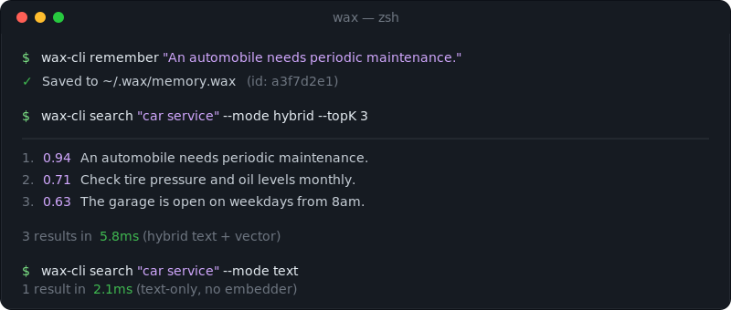

<!-- HEADER:START -->
<div align="center">
  
</div>

<div style="height: 16px;"></div>

<p align="center">
  <strong>Give your AI agent a memory that never forgets.</strong><br/>
  One file. Zero cloud. Blazing fast recall on Apple Silicon.
</p>

<p align="center">
  <a href="https://github.com/christopherkarani/Wax/releases"></a>
  <a href="https://developer.apple.com/ios/"></a>
  <a href="https://github.com/christopherkarani/Wax/blob/main/LICENSE"></a>
  <a href="https://github.com/christopherkarani/Wax/stargazers"></a>
</p>

<p align="center">
  <a href="README.md">English</a> · <a href="Resources/locales/README.es.md">Español</a> · <a href="Resources/locales/README.fr.md">Français</a> · <a href="Resources/locales/README.ja.md">日本語</a> · <a href="Resources/locales/README.ko.md">한국어</a> · <a href="Resources/locales/README.pt.md">Português</a> · <a href="Resources/locales/README.zh-CN.md">中文</a>
</p>
<!-- HEADER:END -->

---

## What is Wax?

Wax is a Swift-native memory engine for AI agents. It stores documents, embeddings, and structured knowledge in a **single `.wax` file** that lives entirely on your device.

No servers. No API keys. No Docker. Just one file you can AirDrop, sync, or back up like any other document.

```swift
import Wax

let memory = try await Memory(at: url)
try await memory.save("The user prefers dark mode and uses Vim keybindings.")
let results = try await memory.search("What editor does the user like?")
// → "The user prefers dark mode and uses Vim keybindings."
```

<p align="center">
  
</p>

### What you can build

- **Persistent chatbots** — Your assistant remembers every conversation, preference, and decision across sessions.
- **Coding agents with long-term memory** — Claude Code or Cursor that recalls your codebase patterns, architectural decisions, and TODOs from last week.
- **Personal knowledge bases** — Semantic search over your notes, documents, and web clips. Ask "What did I read about HNSW?" and get the exact paragraph.
- **On-device RAG** — Ship AI features in your iOS or macOS app without calling the cloud.

---

## Choose Your Path

Wax meets you where you are. Pick the path that matches what you're building:

| 🛠️ Swift Developer | ⌨️ CLI Power User | 🤖 AI Agent Setup |
|:--------------------|:------------------|:------------------|
| **You want:** Embed memory in your iOS/macOS app or Swift tool. | **You want:** A command-line memory store you can script against. | **You want:** Your AI assistant (Claude Code, Cursor, etc.) to remember context across sessions. |
| **Get started:** [Swift Quick Start](#swift-quick-start) ↓ | **Get started:** [CLI Quick Start](#cli-quick-start) ↓ | **Get started:** [Agent Quick Start](#agent-quick-start) ↓ |

---

## Swift Quick Start

### 1. Add Wax to your project

**Swift Package Manager**

```swift
// Package.swift
dependencies: [
    .package(url: "https://github.com/christopherkarani/Wax.git", from: "0.1.8")
]
```

Or in Xcode: **File → Add Package Dependencies →** `https://github.com/christopherkarani/Wax.git`

### 2. Copy-paste this into your app

```swift
import Foundation
import Wax

let url = URL.documentsDirectory.appending(path: "agent.wax")

// Open a memory store
let memory = try await Memory(at: url)

// Save something
try await memory.save("The user is building a habit tracker in SwiftUI.")

// Recall it later — works even if the app was killed
let results = try await memory.search("What is the user building?")
if let best = results.items.first {
    print("Found: \(best.text)")
    // → "Found: The user is building a habit tracker in SwiftUI."
}

try await memory.close()
```

<details>
<summary><strong>SwiftUI example</strong></summary>

```swift
import SwiftUI
import Wax

struct ContentView: View {
    @State private var result = "Searching…"

    var body: some View {
        Text(result)
            .task {
                do {
                    let url = URL.documentsDirectory.appending(path: "agent.wax")
                    let memory = try await Memory(at: url)

                    try await memory.save("The user is building a habit tracker in SwiftUI.")
                    let context = try await memory.search("What is the user building?")

                    result = context.items.first?.text ?? "Nothing found"
                    try await memory.close()
                } catch {
                    result = "Error: \(error.localizedDescription)"
                }
            }
    }
}
```

</details>

<details>
<summary><strong>CLI tool (<code>main.swift</code>)</strong></summary>

```swift
import Foundation
import Wax

@main
struct AgentMemory {
    static func main() async throws {
        let url = URL.documentsDirectory.appending(path: "agent.wax")
        let memory = try await Memory(at: url)

        try await memory.save("The user is building a habit tracker in SwiftUI.")

        let results = try await memory.search("What is the user building?")
        if let best = results.items.first {
            print("Found: \(best.text)")
        }

        try await memory.close()
    }
}
```

</details>

Looking to store persistent facts and long-term reasoning? See [Structured Memory](Sources/WaxCore/WaxCore.docc/Articles/StructuredMemory.md).

---

## CLI Quick Start

### 1. Install

```bash
# Build from source (requires Swift 6+)
git clone https://github.com/christopherkarani/Wax.git
cd Wax
swift build -c release

# The binary is now at .build/release/wax-cli
cp .build/release/wax-cli /usr/local/bin/
```

### 2. Remember and recall from the terminal

```bash
# Save a memory
wax-cli remember "An automobile needs periodic maintenance."

# Search it back
wax-cli search "car service" --mode hybrid --topK 3

# Simple text-only search (no setup required)
wax-cli search "car service" --mode text
```

For long-running sessions, start the daemon:

```bash
wax-cli daemon --store-path ~/.wax/memory.wax
```

Then send JSON-line commands:

```json
{"id":"1","command":"remember","content":"An automobile needs periodic maintenance."}
{"id":"2","command":"search","query":"car service","mode":"hybrid","topK":3}
{"id":"3","command":"shutdown"}
```

> [!NOTE]
> Vector search requires the embedder. If it's unavailable, hybrid/vector commands fail loudly instead of silently falling back to text-only mode.

---

## Agent Quick Start

Give your AI coding assistant (Claude Code, Cursor, Windsurf) a persistent memory that survives across sessions.

### 1. Install the MCP server

```bash
npx -y waxmcp@latest mcp install --scope user
```

This stages the Wax runtime locally and registers `wax-mcp` with your assistant. `npx` is only used for the one-time install.

### 2. Install the Wax skill (recommended)

```bash
# From within your project directory
claude install-skill https://github.com/christopherkarani/Wax/tree/main/Resources/skills/public/wax
```

This lets your assistant write correct Wax code without extra prompt scaffolding.

### 3. Or paste this starter prompt

<details>
<summary><strong>Wax starter prompt (click to expand, then copy)</strong></summary>

```text
Use the Wax MCP server for persistent memory in this repo.

Workflow rules:
- At session start, call `handoff_latest` first to load prior context, then call `session_start` once and keep the returned `session_id`.
- Use `remember` to store decisions, discoveries, and short factual notes. If the memory is session-scoped, pass `session_id` as a top-level argument. Do not put `session_id` inside `metadata`.
- Use `recall` for assembled context and `search` for raw ranked hits.
- Prefer `mode: "hybrid"` when semantic retrieval helps. Use `mode: "text"` when I want a fast or deterministic lexical lookup.
- Do not manage `SESSION_STORE`, `--store-path`, or `flush` in normal agent flows. The broker owns long-term memory and virtual session stores.
- Use `handoff` near the end of the session with `content`, optional `project`, and `pending_tasks`, then call `session_end`.
- Use `corpus_search` only when you need cross-session retrieval across broker-managed session history with provenance metadata.
- Use structured memory tools (`entity_upsert`, `fact_assert`, `fact_retract`, `facts_query`, `entity_resolve`) for stable entities and facts, not transient debugging notes.

Behavior expectations:
- Read existing handoffs and recall results before asking me to restate prior context.
- Keep memory writes concise, factual, and scoped to the task.
- When a cross-session result looks relevant, cite the provenance metadata so we know which session store it came from.
```

</details>

For the full Claude Code setup flow, see [Resources/docs/wax-mcp-setup.md](Resources/docs/wax-mcp-setup.md).

---

## Why Wax?

| Feature          | Wax                    | SQLite (FTS5)          | Cloud Vector DBs       |
|:-----------------|:-----------------------|:-----------------------|:-----------------------|
| **Search**       | Hybrid (Text + Vector) | Text Only*             | Vector Only*           |
| **Latency**      | **~6ms (p95)**         | ~10ms (p95)            | 150ms - 500ms+         |
| **Privacy**      | 100% Local             | 100% Local             | Cloud-hosted           |
| **Setup**        | Zero Config            | Low                    | Complex (API Keys)     |
| **Architecture** | Apple Silicon Native   | Generic                | Varies                 |

### Why a single `.wax` file?

Most RAG setups end up with a database, a vector store, and a file server. Wax keeps the moving pieces smaller by bundling documents, metadata, and indexes into one binary.

- **Less setup** — no Docker stack and no separate database to babysit.
- **Portable** — move the file with AirDrop, iCloud, or whatever sync layer you already use.
- **Atomic** — backup, copy, or delete one file instead of chasing state across services.

---

## Performance

Wax is tuned for M-series hardware and local recall.

### Recall Latency (p95)
*Lower is better. Measured in milliseconds.*

```text
Wax (Hybrid)  |██ 6.1ms
SQLite (Text) |████ 12ms
Cloud RAG     |██████████████████████████████████████████████████ 150ms+
```

### Cold Open Time (p95)
*Lower is better. Measured in milliseconds.*

```text
Wax           |███ 9.2ms
Traditional   |██████████████████████████████████████ 120ms+
```

> [!TIP]
> **Ingest Throughput:** Wax handles **85.9 docs/s** with full hybrid indexing on an M3 Max.
> Full benchmark report: [Resources/docs/benchmarks/2026-03-06-performance-results.md](Resources/docs/benchmarks/2026-03-06-performance-results.md)

---

## Architecture

<details>
<summary><strong>How Wax works under the hood (click to expand)</strong></summary>

Wax uses a frame-based container format and embeds the search engines it needs inside the main file: SQLite FTS5 for text and a Metal-accelerated HNSW index for vectors.

### Internal File Layout

```text
┌──────────────────────────────────────────────────────────────────────────┐
│                          Dual Header Pages (A/B)                         │
│   (Magic, Version, Generation, Pointers to WAL & TOC, Checksums)         │
├──────────────────────────────────────────────────────────────────────────┤
│                          WAL (Write-Ahead Log)                           │
│   (Atomic ring buffer for crash-resilient uncommitted mutations)         │
├──────────────────────────────────────────────────────────────────────────┤
│                          Compressed Data Frames                          │
│   ┌──────────────────┐  ┌──────────────────┐  ┌──────────────────┐       │
│   │ Frame 0 (LZ4)    │  │ Frame 1 (LZ4)    │  │ Frame 2 (LZ4)    │ ...   │
│   │ [Raw Document]   │  │ [Metadata/JSON]  │  │ [System Info]    │       │
│   └──────────────────┘  └──────────────────┘  └──────────────────┘       │
├──────────────────────────────────────────────────────────────────────────┤
│                          Hybrid Search Indices                           │
│   ┌──────────────────────────────┐  ┌──────────────────────────────┐     │
│   │ SQLite FTS5 Blob             │  │ Metal HNSW Index             │     │
│   │ (Text Search + EAV Facts)    │  │ (Vector Search)              │     │
│   └──────────────────────────────┘  └──────────────────────────────┘     │
├──────────────────────────────────────────────────────────────────────────┤
│                          TOC (Table of Contents)                         │
│   (Index of all frames, parent-child relations, and engine manifests)    │
└──────────────────────────────────────────────────────────────────────────┘
```

1. **Atomic resilience:** dual headers and the WAL keep the store consistent even if the process dies mid-write.
2. **Unified retrieval:** one query fans out to both the BM25 text index and the HNSW vector index.
3. **Structured knowledge:** built-in EAV (Entity-Attribute-Value) storage handles durable facts and long-term reasoning.

</details>

---

## Ecosystem Tools

### 🤖 MCP Server
Wax provides a first-class **Model Context Protocol (MCP)** server. Connect your local memory to Claude Code or any MCP-compatible agent.

```bash
npx -y waxmcp@latest mcp install --scope user
```

For the recommended Claude Code prompt and setup flow, see [Resources/docs/wax-mcp-setup.md](Resources/docs/wax-mcp-setup.md).
For the OpenClaw adapter verification pass used in this repo, run [`scripts/verify-openclaw-adapter.sh`](scripts/verify-openclaw-adapter.sh).
For the native-memory operator guide, verifier, and benchmark sweep, see [docs/openclaw-native-memory.md](docs/openclaw-native-memory.md).

The MCP surface now supports managed Markdown round-trips with `markdown_export` / `markdown_sync`, including `MEMORY.md`, daily notes, and `DREAMS.md` promotion review. `markdown_sync` also supports `dry_run`, and OpenClaw-oriented promotion thresholds can be overridden on `session_synthesize` / `memory_promote` or via environment variables.

For remote or team-hosted deployments, `wax-mcp` also supports HTTP transport:

```bash
./.build/debug/wax-mcp --no-embedder --transport http --http-host 127.0.0.1 --http-port 3000
```

### 🔍 WaxRepo
A semantic search TUI for your git history. Index any repository and find code or commits using natural language.

```bash
# From within any git repo
wax-repo index
wax-repo search "where did we implement the WAL?"
```

---

## FAQ

**Q: Do I need an internet connection?**  
A: No. Wax is 100% on-device. No cloud APIs, no network calls.

**Q: How big does the `.wax` file get?**  
A: It depends on your data, but the file stays compact thanks to LZ4 compression. Typical usage: a few MB for thousands of documents.

**Q: Can I sync the `.wax` file across devices?**  
A: Yes. It's a single file. iCloud Drive, Dropbox, AirDrop — whatever you already use.

**Q: What happens if the app crashes during a write?**  
A: Wax uses a write-ahead log (WAL) and dual headers. The store recovers automatically on the next open.

**Q: Does Wax work on Intel Macs?**  
A: Wax is optimized for Apple Silicon (M-series). It may run on Intel via Rosetta but vector acceleration requires Metal performance shaders best supported on Apple Silicon.

**Q: I get "embedder unavailable" when using hybrid search.**  
A: Hybrid and vector search require the local embedding model. Make sure the `WaxEmbedder` target is linked, or fall back to `--mode text` for pure text search.

---

## Community & Support

- 💬 **Discussions & Q&A:** [GitHub Discussions](https://github.com/christopherkarani/Wax/discussions)
- 🐛 **Bug reports:** [GitHub Issues](https://github.com/christopherkarani/Wax/issues)
- ⭐ **Star the repo** to follow releases
- 📖 **Full documentation:** [Resources/docs](Resources/docs)

---

## License

Wax is released under the Apache License 2.0. See [LICENSE](LICENSE) for details.

<div align="center">
<sub>Built for developers who believe user data belongs on the user's device</sub>
</div>
