<!-- HEADER:START -->
<div align="center">

</div>
<!-- HEADER:END -->

<div style="height: 16px;"></div>

<p align="center">
  <strong>Wax é uma camada de memória em arquivo único para agentes de IA nas plataformas Apple.</strong><br/>
  On-device, privada e portátil: sem servidor, sem nuvem, tudo em um único arquivo <code>.wax</code>.
</p>

<p align="center">
  <strong>Idiomas:</strong>
  <a href="README.md">English</a> ·
  <a href="README.zh-CN.md">简体中文</a> ·
  <a href="README.ko.md">한국어</a> ·
  <a href="README.ja.md">日本語</a> ·
  <a href="README.es.md">Español</a> ·
  <a href="README.pt.md">Português</a>
</p>

<!-- NAV:START -->
<p align="center">
  <a href="https://wax.sh">Website</a>
  ·
  <a href="https://wax.sh/docs">Docs</a>
  ·
  <a href="https://github.com/christopherkarani/Wax/discussions">Discussões</a>
</p>
<!-- NAV:END -->

<!-- BADGES:START -->
<p align="center">
  <a href="https://github.com/christopherkarani/Wax/releases"></a>
  <a href="https://www.npmjs.com/package/waxmcp"></a>
  <a href="https://github.com/christopherkarani/Wax/blob/main/LICENSE"></a>
</p>

<p align="center">
  <a href="https://github.com/christopherkarani/Wax/stargazers"></a>
  <a href="https://github.com/christopherkarani/Wax/network/members"></a>
  <a href="https://github.com/christopherkarani/Wax/issues"></a>
</p>
<!-- BADGES:END -->

---

## O que é o Wax?

A maioria dos apps de IA no iOS perde a memória no momento em que o usuário fecha o app. O Wax resolve isso.

Wax é um sistema de memória de IA portátil que empacota documentos, embeddings, índices de busca e metadados em um único arquivo `.wax`. Em vez de combinar Core Data, FAISS, Pinecone ou subir servidores de banco vetorial, o Wax dá aos seus agentes uma memória persistente, pesquisável e privada, totalmente no dispositivo.

O resultado é uma camada de memória nativa em Swift e sem infraestrutura, que fornece memória de longo prazo para agentes de IA levarem para qualquer lugar, sem chamadas de rede, sem chave de API e sem abrir mão da privacidade.


## O que são Smart Frames?

Wax organiza a memória de IA como uma **sequência append-only de Smart Frames**, inspirada em codificação de vídeo.

Um Smart Frame é uma unidade imutável que armazena conteúdo junto com timestamps, checksums, embeddings e metadados. Frames suportam surrogates em camadas: texto completo, resumo ou micro-resumo, permitindo trocar recall por velocidade no momento da consulta.

Esse design baseado em frames permite:

- Escritas append-only sem modificar nem corromper dados existentes
- Inspeção em estilo timeline de como o conhecimento evolui
- Segurança contra falhas com frames imutáveis commitados e WAL
- Compressão eficiente com LZ4/zlib
- Redundância de header duplo para resiliência a corrupção


## Conceitos centrais

- **Recuperação híbrida**: busca por palavra-chave BM25 combinada com similaridade vetorial HNSW. Encontra a memória certa mesmo com palavras diferentes.

- **Embeddings on-device**: MiniLM local com CoreML e Metal. Sem chamadas de API, sem latência adicional e sem custo adicional.

- **Orçamento de tokens**: defina um limite rígido. O Wax corta e comprime contexto automaticamente para sempre caber no limite.

- **Grafo de conhecimento**: triplas entidade-relação com versionamento de fatos. Faça assert, retract e query de conhecimento estruturado junto da memória não estruturada.

- **Handoffs de sessão**: ciclo de sessão de primeira classe com `handoff` / `handoff-latest` para continuidade entre conversas.

- **Arquivo único portátil**: toda a memória fica em um arquivo `.wax`. Faça backup, sincronize e mova facilmente.


## Casos de uso

- **Agentes conversacionais** que lembram preferências, histórico e fatos entre sessões
- **Apps de notas** com busca semântica ("encontre tudo que escrevi sobre WWDC")
- **Assistentes pessoais** que aprendem hábitos do usuário sem enviar dados para fora do dispositivo
- **Pipelines RAG** totalmente on-device para aplicações sensíveis ou offline-first
- **Agentes Claude Code / MCP** com memória persistente de longo prazo via servidor MCP
- **Video RAG** para indexar transcrições e legendas com busca em linguagem natural


## SDKs e CLI

| Pacote | Instalação | Descrição |
|---|---|---|
| **Swift SDK** | Swift Package Manager | Biblioteca principal para apps iOS e macOS |
| **MCP Server** | `npx -y waxmcp@latest mcp install` | Integração com Claude Code / MCP |
| **CLI** | `npx -y waxmcp@latest` | Comandos de terminal para remember, recall e search |

---

## Instalação

### Swift Package Manager

```swift
// Package.swift
dependencies: [
    .package(url: "https://github.com/christopherkarani/Wax.git", from: "0.1.8")
],
targets: [
    .target(
        name: "MyApp",
        dependencies: [
            .product(name: "Wax", package: "Wax"),
            .product(name: "WaxVectorSearchMiniLM", package: "Wax")
        ]
    )
]
```

Ou no Xcode: **File > Add Package Dependencies** e cole a URL do repositório.

### MCP Server (Claude Code)

```bash
npx -y waxmcp@latest mcp install --scope user
```

### Módulos

| Módulo | Propósito |
|---|---|
| `Wax` | Orquestrador completo com busca híbrida, RAG e grafo de conhecimento |
| `WaxCore` | Armazenamento de frames, WAL e engine de commit de baixo nível |
| `WaxTextSearch` | Busca textual BM25 (GRDB + FTS5) |
| `WaxVectorSearch` | Busca por similaridade vetorial HNSW (USearch) |
| `WaxVectorSearchMiniLM` | Provedor de embeddings MiniLM on-device |

---

## Início rápido

```swift
import Wax
import WaxVectorSearchMiniLM

// 1. Abra (ou crie) um store de memória
let memory = try await MemoryOrchestrator.openMiniLM(
    at: .documentsDirectory.appending(path: "agent.wax")
)

// 2. Armazene memórias
try await memory.remember("User prefers concise answers and hates bullet points.")
try await memory.remember("The user's name is Alex and they live in Toronto.")
try await memory.remember("Alex is building a habit tracker in SwiftUI.")

// 3. Recupere contexto relevante semanticamente
let context = try await memory.recall(query: "how should I address the user?")
print(context.items.map(\.text))
// ["The user's name is Alex and they live in Toronto.",
//  "User prefers concise answers and hates bullet points."]
```

### Grafo de conhecimento

```swift
// Criar entidades
try await memory.upsertEntity(key: "person:alex", kind: "person", aliases: ["Alex", "the user"])

// Afirmar fatos
try await memory.assertFact(subject: "person:alex", predicate: "lives_in", object: "Toronto")
try await memory.assertFact(subject: "person:alex", predicate: "building", object: "habit tracker")

// Consultar fatos
let facts = try await memory.facts(subject: "person:alex")
```

### Handoffs de sessão

```swift
// Fim da sessão: salve contexto para a próxima
try await memory.rememberHandoff(
    summary: "Helped Alex debug a SwiftUI layout issue",
    project: "habit-tracker",
    pendingTasks: ["Fix the tab bar animation", "Add onboarding flow"]
)

// Início da próxima sessão: continue de onde parou
if let handoff = try await memory.latestHandoff(project: "habit-tracker") {
    print(handoff.summary)
    print(handoff.pendingTasks)
}
```

---

## Integração com Claude Code

Depois de instalar o servidor MCP, adicione isto ao seu `CLAUDE.md` para o Claude Code usar o Wax como memória:

<details>
<summary><strong>Trecho do CLAUDE.md</strong> (clique para expandir)</summary>

```markdown
## Rules

1. **Session start** — call `wax_handoff_latest` to resume prior context
2. **Before answering** — call `wax_recall` to check what you already know
3. **When you learn something durable** — call `wax_remember`
4. **When corrected** — call `wax_forget` with what changed
5. **Session end** — call `wax_handoff` with summary + pending tasks

## Tools

| Tool | When |
|------|------|
| `wax_remember` | User states a preference, makes a decision, or you learn a stable pattern |
| `wax_recall` | Before answering anything that might have prior context |
| `wax_forget` | User corrects you or facts become outdated |
| `wax_context` | Need the full picture of a specific entity |
| `wax_reflect` | Audit what you know — entity counts, top predicates, memory health |
| `wax_handoff` | Session ending. Pass `pending_tasks` array for continuity |
| `wax_handoff_latest` | Session starting. Loads last handoff |
```

</details>

---

## Arquitetura

<div align="center">

</div>

---

## Performance

<div align="center">

</div>

---

## Formato de arquivo

Tudo vive em um único arquivo `.wax`:

```
┌────────────────────────────┐
│ Header Pages (dual)        │  Magic, version, TOC pointer
├────────────────────────────┤
│ WAL Ring Buffer             │  Crash recovery
├────────────────────────────┤
│ Data Segments              │  LZ4/zlib compressed frames
├────────────────────────────┤
│ Text Index                 │  FTS5 full-text (BM25)
├────────────────────────────┤
│ Vector Index               │  HNSW embeddings (USearch)
├────────────────────────────┤
│ Knowledge Graph            │  Entity-fact triples
├────────────────────────────┤
│ TOC (Footer)               │  Segment offsets + checksums
└────────────────────────────┘
```

Sem arquivos sidecar `.wal`, `.lock`, `.shm` ou similares.

---

## Comparação

| | Wax | ChromaDB | Pinecone | Core Data + FAISS |
|---|---|---|---|---|
| On-device | Yes | No | No | Yes |
| Sem servidor | Yes | No | No | Yes |
| Busca híbrida | Yes | Yes | Yes | Manual |
| Orçamento de tokens | Yes | No | No | No |
| Grafo de conhecimento | Yes | No | No | No |
| Arquivo único | Yes | No | No | No |
| API nativa Swift | Yes | No | No | Partial |
| Servidor MCP | Yes | No | No | No |
| Privacidade (dados ficam no device) | Yes | No | No | Yes |

---

## Requisitos

| | Mínimo |
|---|---|
| Swift | 6.1+ |
| iOS | 18.0 |
| macOS | 15.0 |
| Xcode | 16.0 |

Apple Silicon é recomendado para embeddings acelerados por Metal. Macs Intel fazem fallback para CPU automaticamente.

---

## Roadmap

- [ ] Sync com CloudKit (opt-in, criptografado)
- [ ] Suporte a documentos `.wax` no iCloud Drive
- [ ] Clusterização e deduplicação de memória
- [ ] Modelos de embedding quantizados para menor footprint
- [ ] Template de Instruments para profiling de memória

---

## Contribuindo

Issues e PRs são bem-vindos. Se você está construindo algo com Wax, abra uma [Discussion](https://github.com/christopherkarani/Wax/discussions) e compartilhe.

---

## Histórico de estrelas

[](https://www.star-history.com/#christopherkarani/wax&type=date&legend=top-left)

---

## Licença

Apache License 2.0. Veja [LICENSE](LICENSE) para detalhes.

---

<div align="center">
<sub>Feito para desenvolvedores que acreditam que os dados do usuário pertencem ao dispositivo do usuário.</sub>
</div>
